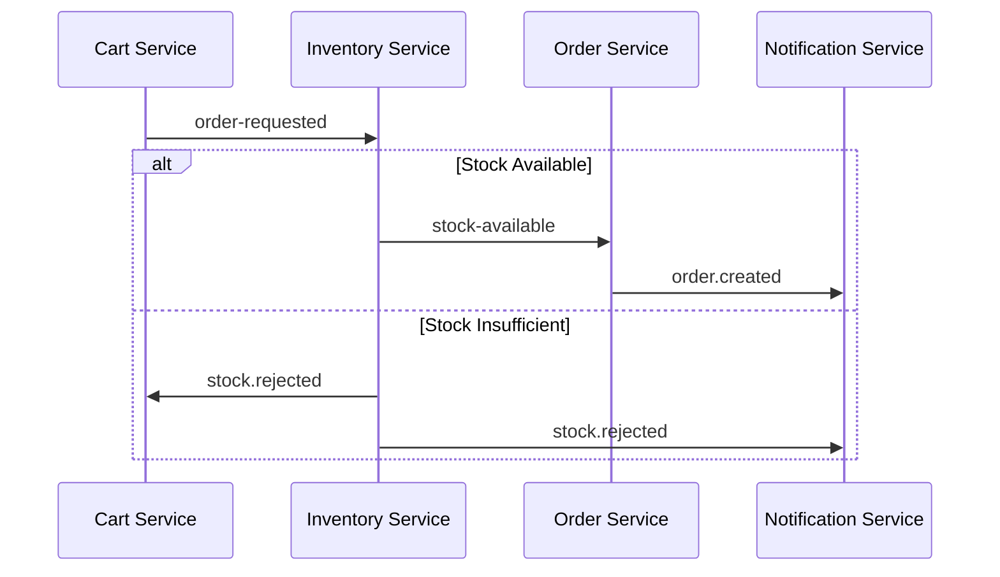
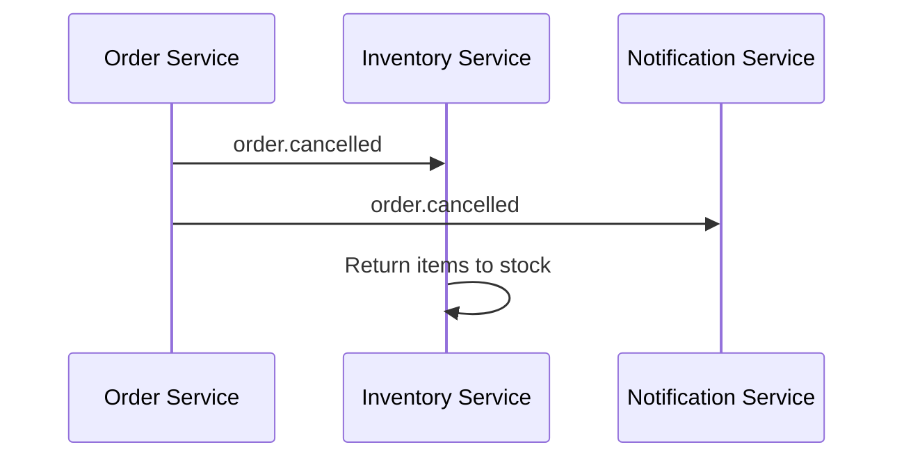
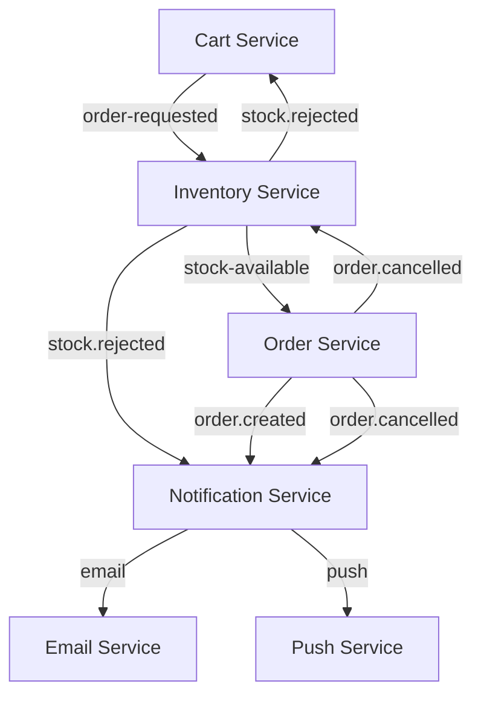
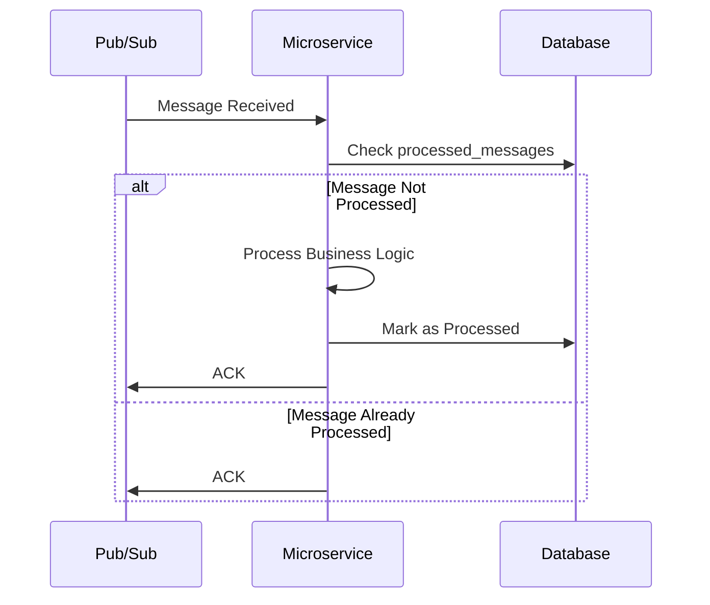

# E-commerce Microservices Platform

Pure-Event driven order proccess applicaiton built with microservices architecture, featuring:
- Product Management
- Order Processing
- Inventory Management
- Customer Management
- Notification System
- Email Service
- Cart Service

## Project Architecture

This project is built using a monorepo architecture, where all microservices are managed in a single repository. I chose this approach for several key benefits:

1. **Unified Development Experience**
   - Single repository for all services
   - Shared configuration and tooling
   - Consistent coding standards across services
   - Simplified dependency management

2. **Code Reusability**
   - Shared types and interfaces
   - Common utilities and helpers
   - Consistent error handling
   - Shared testing infrastructure

3. **Simplified Deployment**
   - Coordinated versioning
   - Atomic commits across services
   - Easier dependency management
   - Simplified CI/CD pipeline setup

4. **Better Collaboration**
   - Single source of truth
   - Easier code review process
   - Simplified onboarding for new developers
   - Better visibility across the entire system

5. **Development Efficiency**
   - Faster local development setup
   - Easier cross-service debugging
   - Simplified dependency updates
   - Better tooling support

## Assumptions

1. **Authentication**
   - User authentication is handled externally
   - All API requests include a valid user token
   - Customer IDs are provided in the request headers
   - The following customer IDs are predefined for testing:
     - `550e8400-e29b-41d4-a716-446655440000` - John Smith
     - `550e8400-e29b-41d4-a716-446655440001` - Jane Doe
     - `550e8400-e29b-41d4-a716-446655440002` - Robert Johnson
     - `550e8400-e29b-41d4-a716-446655440003` - Emily Davis
     - `550e8400-e29b-41d4-a716-446655440004` - Michael Wilson

2. **Data Consistency**
   - Product SKUs are unique across the system
   - Customer IDs are UUIDs
   - All timestamps are in UTC

3. **Service Dependencies**
   - PostgreSQL is available and accessible
   - Google Cloud Pub/Sub is configured
   - All services can communicate with each other

4. **Cart Service Specific**
   - Each customer has at most one active cart
   - Cart is automatically created when first item is added
   - Cart items include product SKU and quantity
   - Cart has a `cart_locked` flag that becomes true when an order is created
   - Cart operations require a valid customer ID in the request header
   - Cart is associated with a customer ID

## API Endpoints

### Product Service (Port: 3001)
- `GET /products` - List all products
- `GET /products/:sku` - Get product by SKU
- `POST /products` - Create new product
- `PUT /products/:sku` - Update product
- `DELETE /products/:sku` - Delete product
- `GET /` - Health check

### Order Service (Port: 3000)
- `GET /orders` - List all orders
- `GET /orders/:id` - Get order by ID
- `POST /orders` - Create new order
- `PUT /orders/:id` - Update order
- `DELETE /orders/:id` - Delete order
- `GET /` - Health check

### Inventory Service (Port: 3002)
- `GET /inventory` - List all inventory items
- `GET /inventory/:sku` - Get inventory item by SKU
- `POST /inventory` - Create new inventory item
- `PUT /inventory/:sku` - Update inventory item
- `DELETE /inventory/:sku` - Delete inventory item
- `GET /` - Health check

### Customer Service (Port: 3006)
- `GET /` - Health check
- `GET /customers` - List all customers
- `POST /customers` - Create new customer
- `GET /customers/:id` - Get customer by ID
- `PUT /customers/:id` - Update customer
- `DELETE /customers/:id` - Delete customer

### Notification Service (Port: 3003)
- `GET /notifications` - List all notifications
- `GET /notifications/:id` - Get notification by ID
- `POST /notifications` - Create new notification
- `GET /` - Health check

### Email Service (Port: 3004)
- `GET /` - Health check

### Cart Service (Port: 3005)
- `GET /` - Health check
- `POST /cart/items` - Add product to cart (creates cart if not exists)
- `DELETE /cart/items/:product_sku` - Remove item from cart
- `GET /cart` - Get current cart details
- `POST /cart/convert-to-order` - Convert cart to order (locks cart and publishes order-requested event)

## Events

### Order Requested Event
- **Topic**: `order-requested`
- **Published by**: Cart Service
- **Subscribed by**: Inventory Service
- **Payload**:
  ```typescript
  {
    cart_id: string;
    customer_id: string;
    items: Array<{
      product_sku: string;
      quantity: number;
    }>;
  }
  ```

### Stock Rejected Event
- **Topic**: `stock.rejected`
- **Published by**: Inventory Service
- **Subscribed by**: Cart Service, Notification Service
- **Payload**:
  ```typescript
  {
    cart_id: string;
    customer_id: string;
    reason: 'insufficient_stock';
    details: Array<{
      product_sku: string;
      requested: number;
      available: number;
    }>;
  }
  ```

## Event Flow

| Event Name | Published By | Subscriber | Subscriber Action |
|------------|-------------|------------|------------------|
| `order-requested` | Cart Service | Inventory Service | Checks inventory levels for each item in the cart. If sufficient, publishes `stock-available` event. If insufficient, publishes `stock.rejected` event. |
| `stock.rejected` | Inventory Service | Cart Service | Updates cart status to 'stock-unavailable' and unlocks the cart. |
| `stock.rejected` | Inventory Service | Notification Service | Creates both email and push notifications to inform the customer about insufficient stock. |
| `stock-available` | Inventory Service | Order Service | Creates a new order with status 'confirmed' and publishes `order.created` event. |
| `order.created` | Order Service | Notification Service | Creates both email and push notifications to confirm the order creation. |
| `order.cancelled` | Order Service | Inventory Service | Returns the cancelled order items back to inventory stock. |
| `order.cancelled` | Order Service | Notification Service | Creates both email and push notifications to inform about the order cancellation. |

## Services

The platform consists of the following services:

### Core Services
- Order Service
- Inventory Service
- Notification Service

### Additional Services
- Product Service (Product catalog management)
- Email Service (Order notifications)
- Cart Service (Shopping cart management)
- Customer Service (Basic user management)
  - User authentication (assumed to be handled externally)
  - User profile management
  - Basic user operations

## Development

To start all services locally:

```bash
npm run dev
```

## Deployment

The services are deployed using GitHub Actions.

## Documentation

Service-specific documentation will be added as we refactor each service.

## Service Communication

### API Endpoints

| Service | Port | Endpoints |
|---------|------|-----------|
| Product Service | 3001 | `GET /products`, `GET /products/:sku`, `POST /products`, `PUT /products/:sku`, `DELETE /products/:sku`, `GET /` |
| Order Service | 3000 | `GET /orders`, `GET /orders/:id`, `POST /orders`, `PUT /orders/:id`, `DELETE /orders/:id`, `GET /` |
| Inventory Service | 3002 | `GET /inventory`, `GET /inventory/:sku`, `POST /inventory`, `PUT /inventory/:sku`, `DELETE /inventory/:sku`, `GET /` |
| Customer Service | 3006 | `GET /customers`, `POST /customers`, `GET /customers/:id`, `PUT /customers/:id`, `DELETE /customers/:id`, `GET /` |
| Notification Service | 3003 | `GET /notifications`, `GET /notifications/:id`, `POST /notifications`, `GET /` |
| Email Service | 3004 | `GET /` |
| Push Service | 3007 | `GET /`, `GET /notifications/:customerId` |
| Cart Service | 3005 | `GET /`, `POST /cart/items`, `DELETE /cart/items/:product_sku`, `GET /cart`, `POST /cart/convert-to-order` |

### Event Flow

| Event Name | Published By | Subscriber | Subscriber Action |
|------------|-------------|------------|------------------|
| `order-requested` | Cart Service | Inventory Service | Checks inventory levels for each item in the cart. If sufficient, publishes `stock-available` event. If insufficient, publishes `stock.rejected` event. |
| `stock.rejected` | Inventory Service | Cart Service | Updates cart status to 'stock-unavailable' and unlocks the cart. |
| `stock.rejected` | Inventory Service | Notification Service | Creates both email and push notifications to inform the customer about insufficient stock. Additionaly stock manager can be notified |
| `stock-available` | Inventory Service | Order Service | Creates a new order with status 'confirmed' and publishes `order.created` event. |
| `order.created` | Order Service | Notification Service | Creates both email and push notifications to confirm the order creation. |
| `order.cancelled` | Order Service | Inventory Service | Returns the cancelled order items back to inventory stock. |
| `order.cancelled` | Order Service | Notification Service | Creates both email and push notifications to inform about the order cancellation. |

### Notification Flow

| Event | Source Service | Notification Service Action |
|-------|---------------|----------------------------|
| `order.created` | Order Service | Creates both email and push notifications for order confirmation |
| `order.cancelled` | Order Service | Creates both email and push notifications for order cancellation |
| `stock.rejected` | Inventory Service | Creates both email and push notifications for stock unavailability |

## Message Queue Implementation

### Google Cloud Pub/Sub Setup

The system uses Google Cloud Pub/Sub for event-driven communication between services. To set up the required topics and subscriptions, use the provided script:

```bash
./scripts/create-pubsub-resources.sh
```

This script will create all necessary topics and subscriptions with appropriate configurations. Make sure to:
1. Set your Google Cloud project ID in the script
2. Have the necessary permissions
3. Have the Google Cloud SDK installed

### Idempotency Implementation

The system implements idempotency to ensure messages are processed exactly once, even in case of retries or duplicate deliveries. This is crucial for maintaining data consistency across services.

#### Database Schema

Each service maintains a `processed_messages` table with the following structure:
```sql
CREATE TABLE processed_messages (
  id SERIAL PRIMARY KEY,
  message_id VARCHAR(255) NOT NULL,
  event_type VARCHAR(100) NOT NULL,
  service_name VARCHAR(100) NOT NULL,
  status VARCHAR(50) NOT NULL,
  processed_at TIMESTAMP WITH TIME ZONE DEFAULT CURRENT_TIMESTAMP,
  error_message TEXT,
  UNIQUE(message_id, service_name)
);
```

#### Processing Flow

1. **Message Reception**:
   - Service receives a message from Pub/Sub
   - Checks if message ID exists in `processed_messages` table
   - If exists, acknowledges and skips processing
   - If not, proceeds with business logic

2. **Message Processing**:
   - Executes business logic
   - On success: marks message as processed with 'success' status
   - On failure: marks message as processed with 'failed' status and error details

3. **Error Handling**:
   - Failed messages are marked with error details
   - Messages can be safely retried due to idempotency checks
   - Database errors during checks default to safe behavior

#### Benefits

- **Data Consistency**: Prevents duplicate processing of messages
- **Reliability**: Enables safe retries of failed messages
- **Audit Trail**: Maintains record of message processing history
- **Error Recovery**: Provides visibility into failed message processing

#### Example Implementation

```typescript
async function handleMessage(message) {
  // Check if message is already processed
  if (await isMessageProcessed(message.id)) {
    console.log('Message already processed, skipping:', message.id);
    message.ack();
    return;
  }

  try {
    // Process message
    await processBusinessLogic(message.data);
    
    // Mark as processed on success
    await markMessageProcessed(message.id, 'event-type', 'success');
    message.ack();
  } catch (error) {
    // Mark as failed on error
    await markMessageProcessed(
      message.id, 
      'event-type', 
      'failed', 
      error.message
    );
    message.nack();
  }
}
```

### Event Flow

The system uses the following event flow for order processing:

1. **Order Requested**:
   - Cart Service publishes `order-requested` event
   - Inventory Service subscribes and checks stock

2. **Stock Check**:
   - If stock available: publishes `stock-available` event
   - If stock insufficient: publishes `stock.rejected` event

3. **Order Creation**:
   - Order Service subscribes to `stock-available`
   - Creates order and publishes `order.created` event

4. **Order Cancellation**:
   - Order Service handles cancellation
   - Publishes `order.cancelled` event
   - Inventory Service returns items to stock

5. **Notifications**:
   - Notification Service subscribes to relevant events
   - Sends appropriate notifications to customers

### Google Cloud Pub/Sub Choice
We chose Google Cloud Pub/Sub as our message queue implementation for several reasons:
1. **Cloud-Native Integration**: Since we're deploying our services on Google Cloud Platform, Pub/Sub provides seamless integration with other GCP services and CI/CD pipelines.
2. **Managed Service**: Pub/Sub is a fully managed service, reducing operational overhead and providing automatic scaling.
3. **Global Availability**: Pub/Sub offers global message routing and low-latency delivery across regions.
4. **Built-in Features**: Includes message ordering, exactly-once delivery, and dead letter queues out of the box.

### Alternative Implementations

#### RabbitMQ Implementation
If we were to use RabbitMQ, the implementation would differ in these ways:
1. **Connection Management**:
   ```typescript
   // Instead of PubSub initialization
   const connection = await amqp.connect('amqp://localhost');
   const channel = await connection.createChannel();
   ```
2. **Topic Declaration**:
   ```typescript
   // Instead of pubsub.topic()
   await channel.assertExchange('order-requested', 'topic', { durable: true });
   ```
3. **Message Publishing**:
   ```typescript
   // Instead of topic.publishMessage()
   channel.publish('order-requested', 'order.created', Buffer.from(JSON.stringify(data)));
   ```
4. **Message Consumption**:
   ```typescript
   // Instead of subscription.on('message')
   channel.consume('order-queue', async (message) => {
     if (message) {
       const data = JSON.parse(message.content.toString());
       // Process message
       channel.ack(message);
     }
   });
   ```

#### Kafka Implementation
If we were to use Kafka, the implementation would differ in these ways:
1. **Producer Setup**:
   ```typescript
   // Instead of PubSub initialization
   const producer = kafka.producer();
   await producer.connect();
   ```
2. **Topic Creation**:
   ```typescript
   // Instead of pubsub.topic()
   const admin = kafka.admin();
   await admin.createTopics({
     topics: [{ topic: 'order-requested' }],
   });
   ```
3. **Message Publishing**:
   ```typescript
   // Instead of topic.publishMessage()
   await producer.send({
     topic: 'order-requested',
     messages: [{ value: JSON.stringify(data) }],
   });
   ```
4. **Message Consumption**:
   ```typescript
   // Instead of subscription.on('message')
   const consumer = kafka.consumer({ groupId: 'order-group' });
   await consumer.subscribe({ topic: 'order-requested' });
   await consumer.run({
     eachMessage: async ({ message }) => {
       const data = JSON.parse(message.value.toString());
       // Process message
     },
   });
   ```

### Key Differences
1. **Message Ordering**:
   - Pub/Sub: Built-in ordering with message ordering keys
   - RabbitMQ: Requires careful queue configuration
   - Kafka: Natural ordering within partitions

2. **Scalability**:
   - Pub/Sub: Automatic scaling
   - RabbitMQ: Manual cluster setup
   - Kafka: Partition-based scaling

3. **Message Retention**:
   - Pub/Sub: Configurable retention (default 7 days)
   - RabbitMQ: Memory/disk-based
   - Kafka: Configurable retention period

4. **Deployment Complexity**:
   - Pub/Sub: Managed service, minimal setup
   - RabbitMQ: Requires cluster management
   - Kafka: Complex setup, requires Zookeeper 

### Event Flow Diagrams

#### Order Processing Flow


#### Order Cancellation Flow


#### Service Dependencies


#### Message Processing with Idempotency


These diagrams illustrate:
1. The main order processing flow
2. The order cancellation process
3. Service dependencies and event relationships
4. How idempotency is implemented in message processing 